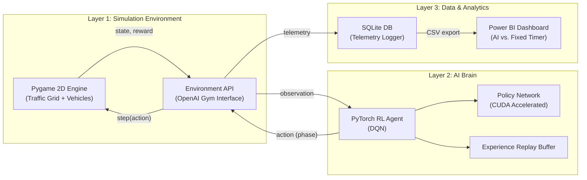

# Urban Digital Twin — AI Traffic Optimizer 🚦🚗


An intelligent traffic management simulation that uses **Reinforcement Learning (Deep Q-Network)** to optimize traffic light sequences in real-time, reducing vehicle wait times and improving throughput compared to traditional fixed-timer systems.

---

## 🎯 Project Highlights
- **Custom Simulation Engine:** Built from scratch using Pygame, featuring realistic vehicle kinematics, queuing logic, and a premium dark-themed visualization.
- **Reinforcement Learning Agent:** PyTorch-based DQN agent trained to dynamically adjust signal phases based on real-time traffic density and queue lengths.
- **Gymnasium Environment:** The simulation is wrapped in a standard OpenAI Gym interface, making it easy to swap in different RL algorithms (e.g., PPO, SAC).
- **Analytics Pipeline:** Built-in SQLite telemetry logger that exports rich metrics (wait times, throughput, queue lengths) for Power BI dashboarding.

## 🧠 Architecture


## New Feature Added
🚀 V2X "Zero-Brake" Intersection Sync
Implemented a Cooperative Trajectory Negotiation system that allows the intersection AI to broadcast optimal speeds to smart vehicles. 
- **Efficiency:** Prevents vehicles from stopping at red lights by timing their arrival for the green phase.
- **Visuals:** Real-time pulsing cyan data-beams connect the infrastructure to synced vehicles.
- **Physics:** Integrated smooth deceleration overrides to eliminate the "accordion effect" in traffic queues.


## 🚀 Getting Started

### 1. Installation
Clone the repository and install the dependencies:
```bash
git clone https://github.com/yourusername/urban-digital-twin.git
cd urban-digital-twin
python -m venv venv
source venv/bin/activate  # On Windows: venv\Scripts\activate
pip install -r requirements.txt
```

### 2. Run the Baseline Simulation
To see the environment running with a traditional fixed-timer traffic light:
```bash
python scripts/visualize.py
```

### 3. Train the AI Agent
Train the Deep Q-Network to optimize the intersection. The script automatically saves checkpoints and training curves to the `models/` directory.
```bash
python scripts/train.py --episodes 100 --max-steps 3600
```

### 4. Evaluate and Export Data
Run a side-by-side evaluation of the trained AI vs. the baseline timer. This logs detailed telemetry and exports it to CSV for dashboarding.
```bash
python scripts/evaluate.py --model models/best_dqn.pt --episodes 5
```

## 📊 Power BI Dashboard Setup (Phase 5)

This project is designed to be paired with a Power BI dashboard to showcase business value.

1. Open Power BI Desktop.
2. Click **Get Data -> Text/CSV** and import `data/exports/episodes.csv` and `data/exports/step_telemetry.csv`.
3. Create a relationship between the tables using `episode_id`.
4. **Key DAX Measures to create:**
   ```dax
   AI_Wait_Time = CALCULATE(AVERAGE(episodes[avg_wait_time]), episodes[agent_type] = "dqn")
   Fixed_Wait_Time = CALCULATE(AVERAGE(episodes[avg_wait_time]), episodes[agent_type] = "fixed_timer")
   Improvement_% = DIVIDE([Fixed_Wait_Time] - [AI_Wait_Time], [Fixed_Wait_Time], 0)
   ```
5. **Recommended Visuals:**
   - **KPI Cards:** AI Wait Time, Fixed Timer Wait Time, % Improvement.
   - **Line Chart:** `step_telemetry[sim_time_sec]` vs `step_telemetry[avg_wait_time]` (Legend: `agent_type`).
   - **Bar Chart:** Total throughput comparison.

## ⚙️ Configuration
All simulation parameters, RL hyperparameters, and reward function weights can be easily tuned in `configs/default.yaml`.

## 🛠️ Testing
The project includes a suite of unit tests. Run them using pytest:
```bash
pytest tests/
```

## 📜 License
This project is licensed under the MIT License - see the LICENSE file for details.
